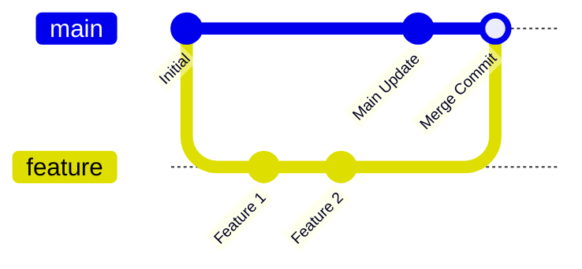
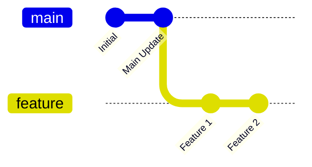

# 2. Branching & Merging 🌿

Branches allow you to isolate development work without affecting the main codebase. They are lightweight pointers to specific commits.

---

## 🌿 Managing Branches

### List Branches
```bash
# List all local branches (current branch is highlighted with an asterisk)
git branch

# List both local and remote-tracking branches
git branch -a

# List branches along with their last commit messages
git branch -v
```

### Create and Delete Branches
```bash
# Create a new branch named 'feature-login' (does not switch to it)
git branch feature-login

# Delete a branch (fails if it contains unmerged changes)
git branch -d feature-login

# Force delete a branch (even if changes are unmerged)
git branch -D feature-login

# Rename the current active branch
git branch -m new-branch-name
```

---

## 🔄 Switching Contexts

To work on a branch, you must check it out (switch your working directory to match that branch's snapshot).

```bash
# Switch to an existing branch (Modern Git)
git switch feature-login

# Create a new branch and switch to it immediately
git switch -c feature-login

# Older Git syntax (still widely used)
git checkout feature-login
git checkout -b feature-login
```

---

## 🤝 Combining Work: Merge vs. Rebase

Once your work on a branch is ready, you need to combine it with your main branch (typically `main` or `developer`). Git offers two primary ways to do this:

### 1. Git Merge (Preserves History)
Integrates changes from another branch. It creates a special "merge commit" that ties the two histories together.



```bash
# 1. Switch to the target branch (e.g., main)
git switch main

# 2. Merge the feature branch into main
git merge feature-login
```

### 2. Git Rebase (Linear History)
Moves or "re-plays" your branch commits on top of another branch. It rewrites project history to make it perfectly linear.



```bash
# 1. Switch to your feature branch
git switch feature-login

# 2. Rebase it on top of main
git rebase main
```

> [!WARNING]
> **The Golden Rule of Rebasing**: Never rebase a branch that has been pushed to a public/shared repository. Rebasing rewrites commit histories, which will disrupt other developers working on the same branch.

---

## 💥 Resolving Merge Conflicts

Conflicts happen when changes are made to the same line of the same file on different branches, and Git doesn't know which version to keep.

### Identifying a Conflict
During a merge or rebase, Git will stop and print a warning:
`CONFLICT (content): Merge conflict in index.html`

If you open the conflicted file, you will see markers:
```html
<<<<<<< HEAD
<h1>Welcome to our site!</h1>  <!-- Your version on the current branch -->
=======
<h1>Welcome to our premium portal!</h1> <!-- Version from the branch being merged -->
>>>>>>> feature-login
```

### How to Resolve:
1. **Open the file**: Choose which block to keep, or merge them manually.
2. **Remove the markers**: Delete the `<<<<<<<`, `=======`, and `>>>>>>>` lines.
3. **Stage the file**: Tell Git you resolved it.
   ```bash
   git add <resolved-file>
   ```
4. **Complete the operation**:
   ```bash
   # If you were merging:
   git commit -m "Resolve merge conflict in index.html"
   
   # If you were rebasing:
   git rebase --continue
   ```

### Aborting the Operation
If you feel overwhelmed and want to undo the merge/rebase attempt entirely:
```bash
git merge --abort
git rebase --abort
```

---

🔙 [[1. Basic Commands|Basic Commands]] | [[Git Index|Back to Index]] | 🌐 [[3. Working with Remotes|Next: Working with Remotes]]
