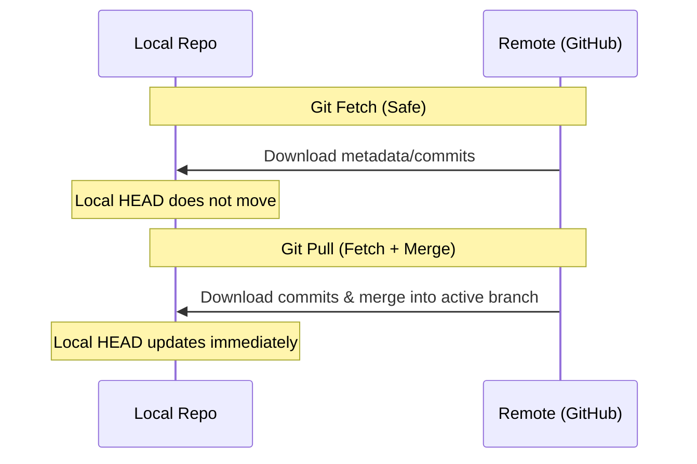

# 3. Working with Remotes 🌐

Remote repositories are versions of your project hosted on the internet or a network (like GitHub, GitLab, or Bitbucket). Understanding remotes allows you to collaborate effectively.

---

## 🔗 Managing Remote Connections

Your local repository links to remotes using alias names. The default remote name is usually `origin`.

### Inspect Remotes
```bash
# List all configured remote names
git remote

# List remote names along with their URLs (fetch and push URLs)
git remote -v

# Show detailed information about a specific remote (e.g., origin)
git remote show origin
```

### Add and Edit Remotes
```bash
# Connect your local repo to a new remote hosting site
git remote add origin <remote-repository-url>

# Change the URL of an existing remote
git remote set-url origin <new-repository-url>

# Rename a remote alias
git remote rename old-name new-name

# Disconnect/Remove a remote reference
git remote remove remote-name
```

---

## 📥 Fetching vs. Pulling (Getting Code)

Downloading changes from a remote repository.



### Git Fetch (Safe)
Downloads files, commits, and refs from the remote repository, but **does not merge** them into your working files. It updates your remote-tracking branches (e.g., `origin/main`).
```bash
# Fetch changes from default remote (origin)
git fetch

# Fetch changes from all configured remotes
git fetch --all
```
> [!TIP]
> Use `git fetch` to see what your teammates have done before you merge their work into your local branch. It is completely safe and won't disrupt your code.

### Git Pull (Fetch + Merge)
Downloads changes and **immediately attempts to merge** them into your current active local branch.
```bash
# Pull changes from the tracked remote branch
git pull

# Pull from a specific remote and branch
git pull origin feature-login

# Pull and rebase instead of merging (keeps local history clean)
git pull --rebase
```

---

## 📤 Pushing (Sending Code)

Uploading your local commits to the remote repository.

### Push to Remote
```bash
# Push commits to the remote branch
git push origin main

# Push and set the remote branch as the "upstream" tracking branch
# (Subsequent pushes/pulls on this branch only require running 'git push' or 'git pull')
git push -u origin feature-login
```

### Force Pushing (Handle with Care)
If you rewrite local history (e.g., via rebase or amending commits), a standard push will be rejected because remote history is different. You must "force" the push.
```bash
# Force push (overwrites remote branch with your local branch)
git push --force origin feature-login

# Safer force push (only overwrites if no one else has pushed updates to the remote)
git push --force-with-lease
```
> [!CAUTION]
> Never use `--force` on shared main/production branches (like `main` or `develop`). It can delete commits pushed by other collaborators.

---

## 👥 Clone vs. Fork: What is the difference?

* **`git clone`**: A command-line operation that downloads a repository's full database to your local machine. You must have write permissions to push changes back.
* **Forking**: A GitHub platform feature (not a Git command) that creates a personal copy of someone else's repository under your GitHub account. You can then `clone` your fork, make changes, push them to your fork, and submit a **Pull Request (PR)** to propose changes to the original project.

---

🔙 [[2. Branching & Merging|Branching & Merging]] | [[Git Index|Back to Index]] | 🔄 [[4. Undoing & Resetting|Next: Undoing & Resetting]]
