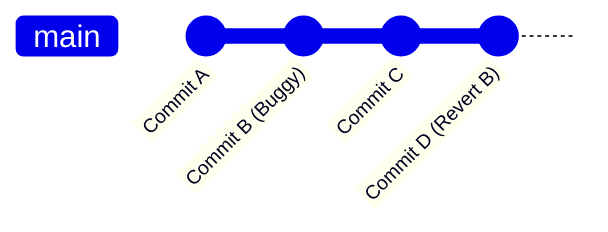

# 4. Undoing & Resetting 🔄

Git provides a robust set of tools to undo changes, fix mistakes, or travel back in time. Understanding how to undo safely is essential for confidence.

---

## 🧹 Undoing Local Changes (Before Committing)

### Discard Changes in Working Directory
If you modified a file but want to discard those changes and reset it back to its last committed state:
```bash
# Modern Git syntax (Recommended)
git restore <filename>

# Older Git syntax (still common)
git checkout -- <filename>

# Discard ALL unstaged changes in the current folder
git restore .
```

### Unstage a File
If you ran `git add` on a file but want to remove it from the staging area (keep the changes, but don't commit them yet):
```bash
# Modern Git syntax (Recommended)
git restore --staged <filename>

# Older Git syntax
git reset HEAD <filename>
```

### Remove Untracked Files
Delete files that are not tracked by Git (e.g. temporary logs, generated build artifacts):
```bash
# Dry run: Show which untracked files will be deleted without actually deleting them
git clean -n

# Force delete all untracked files
git clean -f

# Force delete all untracked files AND directories
git clean -fd
```

---

## ↩️ Undoing Commits (After Committing)

Once a change is committed, you have two options depending on whether you have pushed the commits to a shared repository.

### 1. Safe Option: Git Revert (For Shared/Public Branches)
`git revert` creates a **new commit** that does the exact opposite of a target commit. It is completely non-destructive and safe for shared branches.



```bash
# Revert a commit by its hash (creates a new commit)
git revert <commit-hash>

# Revert without automatically committing, allowing you to edit changes first
git revert -n <commit-hash>
```

### 2. History Rewriting Option: Git Reset (For Local Branches ONLY)
`git reset` moves the branch pointer backward, effectively erasing commits from history.

```bash
git reset --<mode> <commit-hash-or-ref>
```

#### Reset Modes Comparison:

| Reset Mode | Moves Branch Pointer? | Clears Staging Area? | Clears Working Directory? | Safe for Pushed Commits? |
| :--- | :---: | :---: | :---: | :---: |
| **`--soft`** | Yes | ❌ No | ❌ No | ❌ No |
| **`--mixed`** *(default)* | Yes | Yes | ❌ No | ❌ No |
| **`--hard`** | Yes | Yes | Yes | ❌ No |

#### Detailed Reset Commands:

* **Soft Reset**: Keep your changes. The commits are removed, but the changes remain staged in your index. Useful if you want to squash several commits into one.
  ```bash
  # Undo the last commit, but keep its changes staged
  git reset --soft HEAD~1
  ```

* **Mixed Reset (Default)**: Keep changes, but unstage them. The commits are removed and changes are placed in your working directory as unstaged.
  ```bash
  # Undo the last commit, keep changes but unstage them
  git reset HEAD~1
  # (or equivalently)
  git reset --mixed HEAD~1
  ```

* **Hard Reset**: Erase everything. The commits are deleted, the staging area is cleared, and your working directory files are reset. **All uncommitted changes are lost forever.**
  ```bash
  # Erase the last commit AND all unstaged/staged modifications
  git reset --hard HEAD~1
  
  # Reset your local branch to match the remote branch exactly
  git reset --hard origin/main
  ```

> [!CAUTION]
> **Warning**: Never perform a `git reset` (especially `--hard`) on commits that have been pushed to a remote repository where others are collaborating. If you must rewrite pushed history, use `git revert`.

---

🔙 [[3. Working with Remotes|Working with Remotes]] | [[Git Index|Back to Index]] | 🚀 [[5. Advanced & Debugging|Next: Advanced & Debugging]]
