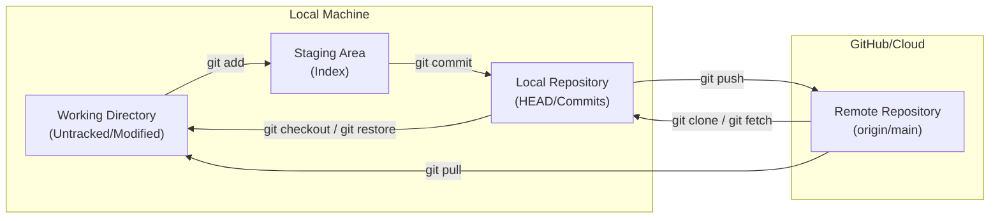

# Git & GitHub Knowledge Hub 🎯

Welcome to your Git reference vault. This workspace is structured to help you learn, search, and master Git commands, from basic operations to complex recovery scenarios.

---

## 🗺️ The Git Workflow Lifecycle

Understanding how data flows between different zones in Git is key to mastering its commands.

---

## 📂 Navigation & Reference Guides

Click on any guide below to explore specific commands, complete with syntax, examples, and best practices:

### 1. 📂 [[1. Basic Commands|Basic Commands]]
*The foundation of version control.*
* Learn how to set up configuration, initialize repositories, track files, commit changes, and view commit history.

### 2. 🌿 [[2. Branching & Merging|Branching & Merging]]
*Working with parallel timelines.*
* Master branches, switching contexts, combining work using Merge or Rebase, and resolving merge conflicts.

### 3. 🌐 [[3. Working with Remotes|Working with Remotes]]
*Connecting with GitHub.*
* Manage remote connections (`origin`), push and pull code, clone repositories, and sync collaborative work.

### 4. 🔄 [[4. Undoing & Resetting|Undoing & Resetting]]
*The Git time machine.*
* How to fix mistakes, revert commits, discard modifications, and understand the difference between soft, mixed, and hard resets.

### 5. 🚀 [[5. Advanced & Debugging|Advanced & Debugging]]
*Power-user tools.*
* Deep dive into stashing temporary changes, cherry-picking commits, interactive rebasing, tags, and searching history with `reflog`.

---

> [!TIP]
> **Pro Tip for Obsidian Users**: 
> * Press `Ctrl + Click` (or `Cmd + Click` on macOS) on any of the folder links above to open the respective file in a new pane.
> * Use `Ctrl + P` to quickly access the command palette and search for files.
