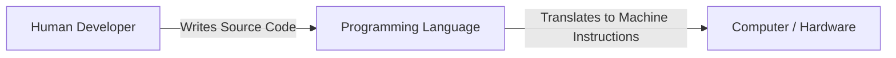
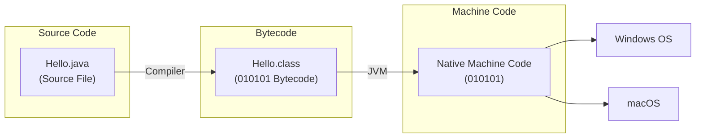
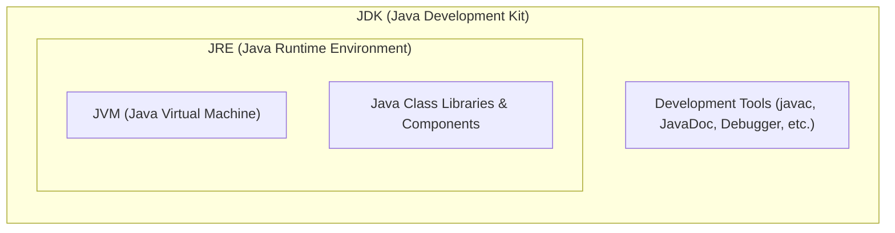

# What is a programming language?


## Overview
A **programming language** is the primary medium through which humans provide instructions to a computer. 

## Key Concepts
- **Machine-Level Instructions:** Computers inherently only understand machine-level instructions ([[03_binary_number_system|binary/0s and 1s]]).
- **The Bridge:** Programming languages act as a bridge between human-readable logic/code and machine-executable instructions, allowing developers to write code that the machine can process and execute effectively.

## Visual Diagram



---

# Working of a Java Program

## Diagram



## Overview & Execution Flow
1. **Source Code:** Written by developers in human-readable `.java` files containing [[02_variables_and_data_types|Variables and Data Types]].
2. **Compilation Process:** The Java source code is compiled by the Java compiler (`javac`) into platform-independent **bytecode** (`Hello.class` files).
3. **Execution/Interpretation:** The Java Runtime Environment (JRE) / Java Virtual Machine (JVM) interprets or executes the bytecode to perform the desired tasks on the underlying system, allowing it to run across target OS environments like Windows and macOS.

---

# JVM, JRE and JDK

## Architecture Diagram



## Core Definitions

### JVM (Java Virtual Machine)
**JVM** is an abstract machine that enables your computer to run a Java program.

### JRE (Java Runtime Environment)
**JRE** is a software package that provides:
- **Java Class Libraries**
- **Java Virtual Machine (JVM)**
- Other components required to **run** Java applications.

### JDK (Java Development Kit)
**JDK** is a software development kit required to **develop** applications in Java.  
In addition to the **JRE**, the JDK contains a number of development tools:
- **Compiler** (`javac`)
- **JavaDoc**
- **Java Debugger** (`jdb`), etc.

---

# Useful Java IDE Typing Shortcuts (Live Templates)

In modern Java IDEs (like IntelliJ IDEA and Eclipse), you can use shorthand triggers followed by `Tab` or `Enter` to auto-generate boilerplate code quickly:

| Shortcut | Triggers | Generated Code |
| :--- | :--- | :--- |
| `main` + `Tab` | `void main()` | Generates modern Java 25+ entry point [[08_methods_and_math|method]]. |
| `sout` + `Tab` | `IO.println();` / `println();` | Compact print output using Java 25 module IO (`import static java.lang.IO.*;`). |
| `souf` + `Tab` | `IO.print();` / `print();` | Formatted output print statement. |
| `soutm` + `Tab` | `println("Class.method");` | Prints current [[10_oop_basics_and_inheritance|class]] and [[08_methods_and_math|method]] name. |
| `soutv` + `Tab` | `println("var = " + var);` | Prints a [[02_variables_and_data_types|variable's]] name and its value. |
| `fori` + `Tab` | `for (var i = 0; i < n; i++) {}` | Standard indexed [[06_loops_and_patterns|for loop]] with `var`. |

### Modern Java 25 Code Example:
In Java 25, **Module Import Declarations** (`import module java.base;`) and **Implicit IO** allow replacing verbose `System.out.println` with clean `println()` / `IO.println()`:

```java
// Java 25 Clean Compact Syntax
import static java.lang.IO.*;

void main() {
    println("Hello, World!");
}
```
Simply type:
1. `main` ➔ press <kbd>Tab</kbd>
2. `sout` ➔ press <kbd>Tab</kbd>