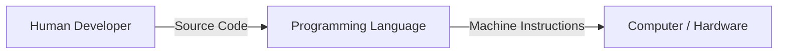
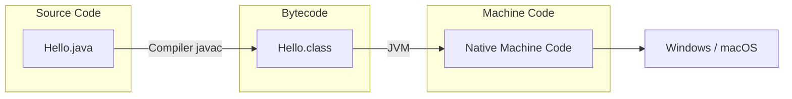
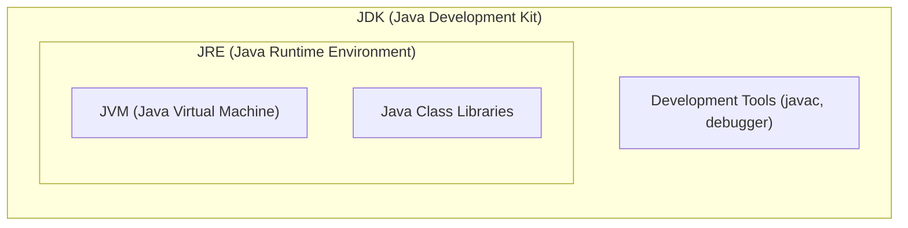

# What is a Programming Language?

A **programming language** acts as a bridge allowing developers to write human-readable code that translates into machine-level instructions ([[03_binary_number_system|binary/0s and 1s]]) for execution.



---

# Working of a Java Program



1. **Source Code:** Written in `.java` files containing [[02_variables_and_data_types|Variables and Data Types]].
2. **Compilation:** `javac` converts source code into platform-independent **bytecode** (`.class`).
3. **Execution:** The **JVM** translates bytecode into native CPU instructions.

---

# JVM, JRE and JDK



- **JVM (Java Virtual Machine):** Executes Java bytecode on target OS.
- **JRE (Java Runtime Environment):** Includes JVM + Class Libraries to **run** applications.
- **JDK (Java Development Kit):** Includes JRE + Dev Tools (`javac`) to **develop** applications.

---

# Java IDE Typing Shortcuts

| Shortcut | Triggers | Generated Code |
| :--- | :--- | :--- |
| `main` + `Tab` | `void main()` | Entry point [[08_methods_and_math|method]]. |
| `sout` + `Tab` | `IO.println();` | Console output using `java.lang.IO`. |
| `soutv` + `Tab` | `IO.println("var = " + var);` | Prints [[02_variables_and_data_types|variable]] name and value. |
| `fori` + `Tab` | `for (var i = 0; i < n; i++) {}` | [[06_loops_and_patterns|for loop]]. |

```java
// Java 25 Compact Syntax
void main() {
    IO.println("Hello, World!");
}
```