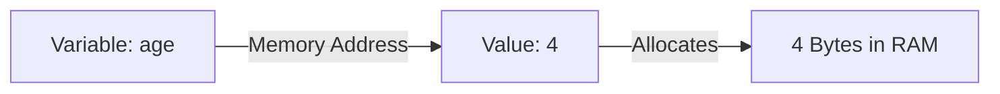

# Java Keywords

Java keywords are reserved words that cannot be used as identifiers (variable names, class names, or method names).

| `abstract` | `continue` | `for`        | `new`       | `switch`       |
| :--------- | :--------- | :----------- | :---------- | :------------- |
| `assert`   | `default`  | `goto`       | `package`   | `synchronized` |
| `boolean`  | `do`       | `if`         | `private`   | `this`         |
| `break`    | `double`   | `implements` | `protected` | `throw`        |
| `byte`     | `else`     | `import`     | `public`    | `throws`       |
| `case`     | `enum`     | `instanceof` | `return`    | `transient`    |
| `catch`    | `extends`  | `int`        | `short`     | `try`          |
| `char`     | `final`    | `interface`  | `static`    | `void`         |
| `class`    | `finally`  | `long`       | `strictfp`  | `volatile`     |
| `const`    | `float`    | `native`     | `super`     | `while`        |

> *Note:* `const` and `goto` are reserved but unused.

---

# Java Variables

A **variable** is a named memory location holding a value.



```java
int age = 4; // Explicit primitive declaration
var x = 14;  // Inferred as int via var
```

## Variable Naming Rules
1. **Case-Sensitive:** `age` and `AGE` are distinct.
2. **Start Characters:** Must start with a letter, `_`, or `$`. Cannot start with digits.
3. **No Whitespace:** Cannot contain spaces.
4. **No Keywords:** Cannot use reserved keywords.

---

# 8 Primitive Data Types

| Data Type | Size | Default | Description |
| :--- | :--- | :--- | :--- |
| `boolean` | 1 bit | `false` | `true` or `false` |
| `byte` | 1 byte | `0` | Whole numbers (-128 to 127) |
| `short` | 2 bytes | `0` | Whole numbers (-32,768 to 32,767) |
| `int` | 4 bytes | `0` | Whole numbers (-2.14B to 2.14B) |
| `long` | 8 bytes | `0L` | Large whole numbers |
| `float` | 4 bytes | `0.0f` | Single-precision decimals (6-7 digits) |
| `double` | 8 bytes | `0.0d` | Double-precision decimals (15 digits) |
| `char` | 2 bytes | `'\u0000'` | Single Unicode character |

---

# Implicit Conversion (Widening)

Smaller data types automatically widen into larger types without data loss:

`byte` ➔ `short` ➔ `int` ➔ `long` ➔ `float` ➔ `double`  
`char` ➔ `int`

```java
int numInt = 100;
long numLong = numInt;      // Automatic widening
double numDouble = numLong; // Automatic widening
```
