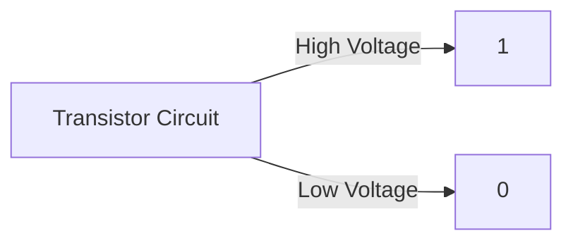

# Binary Number System Overview

The **Binary Number System** is a base-2 system using only **0** (OFF) and **1** (ON).

---

# Convert Binary to Decimal

$$\text{Decimal} = \sum (d_n \times 2^n)$$

### Example: $(1011)_2$ to Decimal
$$1(2^3) + 0(2^2) + 1(2^1) + 1(2^0) = 8 + 0 + 2 + 1 = 11$$

---

# Binary Arithmetic

## Addition Rules:
- $0 + 0 = 0$
- $0 + 1 = 1$
- $1 + 1 = 0$ (carry `1`)
- $1 + 1 + 1 = 1$ (carry `1`)

## Subtraction Rules:
- $0 - 0 = 0$
- $1 - 0 = 1$
- $1 - 1 = 0$
- $0 - 1 = 1$ (borrow `1`)

---

# Two's Complement

Two's complement is used by computers to represent negative numbers:

$$\text{2's Complement} = (\text{1's Complement / Flip Bits}) + 1$$

### Example: $-5$ in 8-Bit Binary
1. Positive 5: `00000101`
2. Flip bits: `11111010`
3. Add 1: `11111011` (Result: $-5$)
