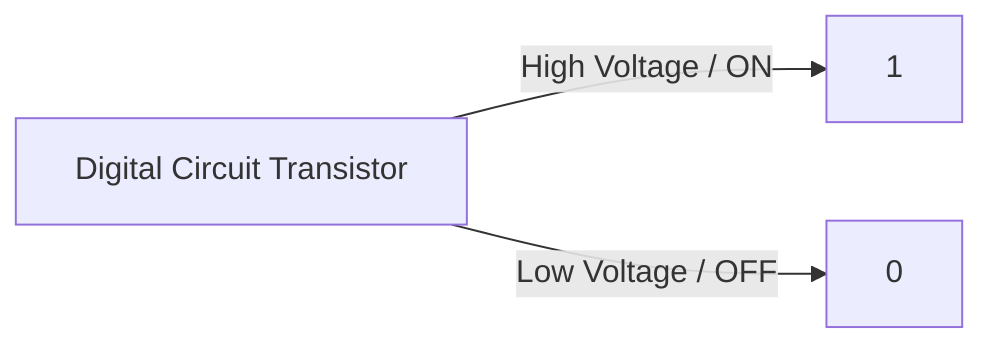

# Binary Number System Overview


The **Binary Number System** is a base-2 positional numeral system that uses only two digits: **0** and **1**. 

- **Bit:** A single binary digit (0 or 1).
- **Byte:** A group of 8 bits.
- **Why Computers Use Binary:** Computers are made of digital electronic circuits (transistors) that operate in two stable states: **ON** (represented by 1 / high voltage) and **OFF** (represented by 0 / low voltage).



---

# Convert Binary to Decimal

To convert a binary number to a decimal (base-10) number, multiply each digit by $2^n$, where $n$ is the position of the digit starting from 0 (from right to left), and sum the results.

### Formula:
$$\text{Decimal} = (d_n \times 2^n) + (d_{n-1} \times 2^{n-1}) + \dots + (d_0 \times 2^0)$$

### Example: Convert $(1011)_2$ to Decimal

| Binary Digit | Position ($n$) | Positional Value ($2^n$) | Calculation |
| :--- | :--- | :--- | :--- |
| `1` | Position 3 | $2^3 = 8$ | $1 \times 8 = 8$ |
| `0` | Position 2 | $2^2 = 4$ | $0 \times 4 = 0$ |
| `1` | Position 1 | $2^1 = 2$ | $1 \times 2 = 2$ |
| `1` | Position 0 | $2^0 = 1$ | $1 \times 1 = 1$ |

**Result:**  
$$8 + 0 + 2 + 1 = 11$$  
$$(1011)_2 = (11)_{10}$$

---

# Binary Addition

Binary addition follows rules similar to decimal addition, but carries over when the sum exceeds 1:

## Rules for Binary Addition:
- $0 + 0 = 0$
- $0 + 1 = 1$
- $1 + 0 = 1$
- $1 + 1 = 0$ (carry `1` to the next left column)
- $1 + 1 + 1 = 1$ (carry `1` to the next left column)

### Example: Add $(1010)_2$ (10) and $(0111)_2$ (7)

```text
   Carry:  1 1
           1 0 1 0   (10)
        +  0 1 1 1   (7)
        -----------
           1 0 0 0 1 (17 in decimal)
```

---

# Binary Subtraction

Binary subtraction is performed using basic borrowing rules:

## Rules for Binary Subtraction:
- $0 - 0 = 0$
- $1 - 0 = 1$
- $1 - 1 = 0$
- $0 - 1 = 1$ (borrow `1` from the next higher position bit)

### Example: Subtract $(0011)_2$ (3) from $(1010)_2$ (10)

```text
   Borrow:   0 10
             1  0  1  0   (10)
          -  0  0  1  1   (3)
          -------------
             0  1  1  1   (7 in decimal)
```

---

# Two's Complement

**Two's Complement** is the standard mathematical method used by computers (including [[01_introduction_and_setup|JVM]]) to represent and store **negative integers** in binary format.

## Steps to Find Two's Complement:

1. **Find 1's Complement:** Invert all bits (change `0` ➔ `1` and `1` ➔ `0`).
2. **Add 1:** Add `1` to the LSB (Least Significant Bit / rightmost bit) of the 1's complement.

$$\text{2's Complement} = (\text{1's Complement}) + 1$$

---

### Example: Represent $-5$ in 8-bit Two's Complement

1. **Positive 5 in 8-bit binary:**  
   `00000101`

2. **Step 1: 1's Complement (Flip bits):**  
   `11111010`

3. **Step 2: Add 1:**  
   ```text
        1 1 1 1 1 0 1 0
     +                1
     ------------------
        1 1 1 1 1 0 1 1
   ```

**Result:**  
$-5$ in 8-bit binary is `11111011`.

> **Key Rule:** If the most significant bit (MSB / leftmost bit) is `1`, the number is **negative**. If it is `0`, the number is **positive**.
