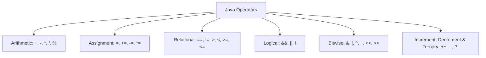

# Types of Operators in Java

An **operator** performs operations on [[02_variables_and_data_types|operands]].



---

# Arithmetic Operators

| Operator | Description | Example ($a = 10, b = 3$) | Result |
| :--- | :--- | :--- | :--- |
| `+` | Addition | `a + b` | `13` |
| `-` | Subtraction | `a - b` | `7` |
| `*` | Multiplication | `a * b` | `30` |
| `/` | Division | `a / b` | `3` |
| `%` | Modulus (Remainder) | `a % b` | `1` |

```java
void main() {
    var a = 10;
    var b = 3;
    IO.println("Sum: " + (a + b));
    IO.println("Remainder: " + (a % b));
}
```

---

# Assignment Operators

| Operator | Example | Equivalent To |
| :--- | :--- | :--- |
| `=` | `x = 5` | `x = 5` |
| `+=` | `x += 3` | `x = x + 3` |
| `-=` | `x -= 2` | `x = x - 2` |
| `*=` | `x *= 4` | `x = x * 4` |
| `/=` | `x /= 2` | `x = x / 2` |
| `%=` | `x %= 3` | `x = x % 3` |

---

# Relational & Logical Operators

| Relational Operator | Meaning | Logical Operator | Meaning |
| :--- | :--- | :--- | :--- |
| `==` | Equal to | `&&` | Logical AND (both true) |
| `!=` | Not equal to | `\|\|` | Logical OR (either true) |
| `>` / `<` | Greater / Less than | `!` | Logical NOT (invert) |
| `>=` / `<=` | Greater/Less or Equal | | |

---

# Bitwise Operators

Bitwise operators manipulate bits using [[03_binary_number_system|binary representation]].

| Operator | Name | Example ($5 = 0101_2, 3 = 0011_2$) | Result |
| :--- | :--- | :--- | :--- |
| `&` | Bitwise AND | `5 & 3` ($0001_2$) | `1` |
| `\|` | Bitwise OR | `5 \| 3` ($0111_2$) | `7` |
| `^` | Bitwise XOR | `5 ^ 3` ($0110_2$) | `6` |
| `~` | Bitwise NOT | `~5` | `-6` |
| `<<` / `>>` | Shift Left / Right | `5 << 1` ($1010_2$) | `10` |

---

# Increment, Decrement & Ternary Operators

```java
void main() {
    var x = 5;
    var pre = ++x; // x=6, pre=6 (Pre-increment)
    var post = x++; // post=6, x=7 (Post-increment)

    var age = 18;
    var status = (age >= 18) ? "Adult" : "Minor";
    IO.println(status);
}
```
