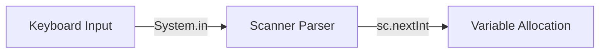
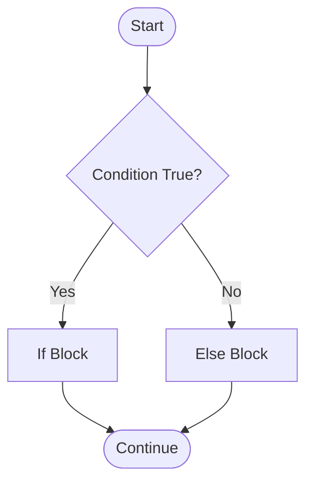

# Taking User Input in Java

In Java, input is read from the user using `java.util.Scanner` or modern `IO.readln()` (Java 25).

---

# `Scanner` Class in Java

The `Scanner` class (`java.util.Scanner`) parses primitive types and strings from `System.in`.

## Common `Scanner` Methods for All Data Types

| Data Type | Scanner Method | Description |
| :--- | :--- | :--- |
| `int` | `sc.nextInt()` | Reads integer numbers |
| `double` | `sc.nextDouble()` | Reads double floating-point numbers |
| `float` | `sc.nextFloat()` | Reads float numbers |
| `long` | `sc.nextLong()` | Reads long whole numbers |
| `boolean` | `sc.nextBoolean()` | Reads `true` or `false` |
| `String` (Word) | `sc.next()` | Reads single word (stops at space) |
| `String` (Line) | `sc.nextLine()` | Reads full sentence/line |
| `char` | `sc.next().charAt(0)` | Reads single character |

---

## How `Scanner` Works



---

## Modern Java 25 `Scanner` Code Example (All Data Types):

```java
import java.util.Scanner;

void main() {
    try (var sc = new Scanner(System.in)) {
        IO.print("Enter int age: ");
        int age = sc.nextInt();

        IO.print("Enter double salary: ");
        double salary = sc.nextDouble();

        IO.print("Enter boolean isStudent (true/false): ");
        boolean isStudent = sc.nextBoolean();

        IO.print("Enter char gender (M/F): ");
        char gender = sc.next().charAt(0);

        sc.nextLine(); // Consume leftover newline character

        IO.print("Enter full name: ");
        String name = sc.nextLine();

        IO.println("\n--- Summary ---");
        IO.println("Name: " + name + ", Age: " + age);
        IO.println("Salary: " + salary + ", Gender: " + gender + ", Student: " + isStudent);
    }
}
```

---

# Java 25 Console Reading Alternative (`IO.readln()`)

In Java 25, `IO.readln()` provides a clean alternative without declaring `Scanner`:
```java
void main() {
    var name = IO.readln("Enter name: ");
    IO.println("Hello, " + name + "!");
}
```
No, `IO.readln()` **cannot take any data type directly**. It has one fixed rule: it **always returns a `String`**

---

# Java Conditional Statements



### `if - else` Statements
```java
void main() {
    var number = 10;
    if (number % 2 == 0) {
        IO.println("Even");
    } else {
        IO.println("Odd");
    }
}
```

### `if - else if - else` Statements
```java
void main() {
    var score = 85;
    if (score >= 90) IO.println("Grade: A");
    else if (score >= 80) IO.println("Grade: B");
    else IO.println("Grade: F");
}
```

### Nested `if - else` Statements
```java
void main() {
    var age = 20;
    var hasID = true;

    if (age >= 18) {
        if (hasID) IO.println("Entry Allowed");
        else IO.println("ID required");
    } else {
        IO.println("Underage");
    }
}
```

### Ternary Operator (`?:`)
```java
void main() {
    var age = 18;
    var status = (age >= 18) ? "Adult" : "Minor";
    IO.println(status);
}
```

---

# Java 25 `switch` Expressions & Pattern Matching

Switch expressions (`->`) eliminate `break` statements and fall-through bugs, allowing direct value assignments and type pattern matching with `when` guards.

```java
// Switch Expression with Arrow Rules
void main() {
    var day = 3;
    var dayName = switch (day) {
        case 1 -> "Monday";
        case 2 -> "Tuesday";
        case 3 -> "Wednesday";
        case 4, 5 -> "Thursday or Friday";
        default -> "Weekend / Invalid day";
    };
    IO.println(dayName);
}
```

```java
// Pattern Matching Switch with 'when' Guard
void checkInput(Object val) {
    switch (val) {
        case Integer i when i >= 90 -> IO.println("High Score: " + i);
        case Integer i              -> IO.println("Score: " + i);
        case String s               -> IO.println("Text: " + s);
        case null, default          -> IO.println("Unknown");
    }
}
```

```java
// Record Pattern Destructuring in Switch
record Point(int x, int y) {}

void processShape(Object obj) {
    switch (obj) {
        case Point(int x, int y) when x == 0 && y == 0 -> IO.println("At Origin (0,0)");
        case Point(int x, int y) -> IO.println("Point at (" + x + "," + y + ")");
        case null, default -> IO.println("Not a point or null"); 
    }
}
```
