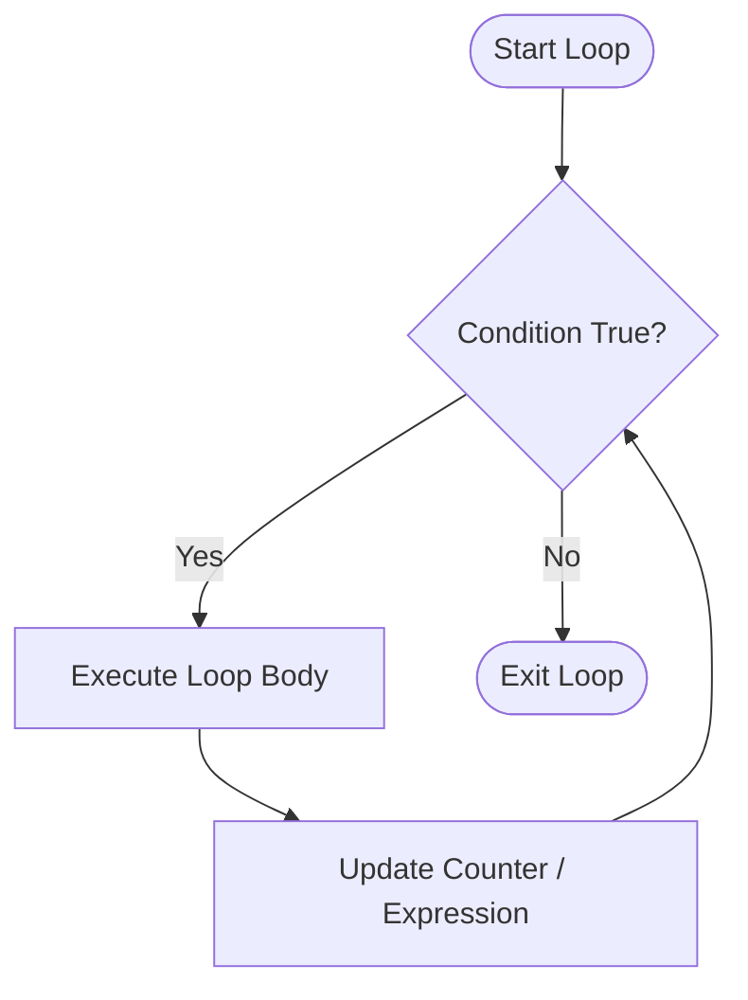

# Loops in Java Overview

Loops repeat a block of code until a specified condition is met. Modern Java 25 uses `var` for loop counters and compact instance `main()` execution.



---

# Elements of Java Loops

Every loop contains four fundamental elements:
1. **Initialization:** Setting the starting value using `var`.
2. **Condition:** Boolean expression evaluated before each iteration.
3. **Body:** Statements executed repeatedly.
4. **Update:** Modifying the loop counter (`++`, `--`, etc.).

---

# Java `for` Loops

Used when the number of iterations is known in advance.

### Modern Java 25 Code Example:
```java
import static java.lang.IO.*;
void main() {
    // Modern for loop with local variable type inference (var)
    for (var i = 1; i <= 5; i++) {
        println("Iteration: " + i);
    }
}
```

---

# Java `while` Loops

Used when iterations depend on a condition that may change dynamically.

### Modern Java 25 Code Example:
```java
void main() {
    var count = 1;
    while (count <= 3) {
        println("Count is: " + count);
        count++;
    }
}
```

---

# Java `do-while` Loops

Executes the loop body **at least once** before testing the condition.

### Modern Java 25 Code Example:
```java
void main() {
    var num = 5;
    do {
        println("Number: " + num);
        num++;
    } while (num < 5); // Condition false, but body executed once
}
```

---

# `break` Statements in Java

Immediately terminates the nearest enclosing loop.

### Modern Java 25 Code Example:
```java
void main() {
    for (var i = 1; i <= 10; i++) {
        if (i == 5) {
            break; // Stop loop when i reaches 5
        }
        println("i = " + i);
    }
}
```

---

# `continue` Statements in Java

Skips the current iteration and jumps to the next update/condition evaluation.

### Modern Java 25 Code Example:
```java
void main() {
    for (var i = 1; i <= 5; i++) {
        if (i == 3) {
            continue; // Skip printing 3
        }
        println("i = " + i);
    }
}
```

---

# Nested Loops and Patterns Printing

A loop placed inside another loop. Common for 2D matrix traversal and pattern printing.

### Modern Java 25 Code Example (Right-Angled Triangle Pattern):
```java
void main() {
    var rows = 4;
    for (var i = 1; i <= rows; i++) {
        for (var j = 1; j <= i; j++) {
            print("* ");
        }
        println();
    }
}
```

---

# Labeled `break` & `continue` Statements

Labels allow `break` or `continue` to target a specific outer loop instead of just the inner-most loop.

### Modern Java 25 Code Example:
```java
void main() {
    outerLoop:
    for (var i = 1; i <= 3; i++) {
        for (var j = 1; j <= 3; j++) {
            if (i == 2 && j == 2) {
                break outerLoop; // Exits the outer loop directly
            }
            println("i = " + i + ", j = " + j);
        }
    }
}
```
