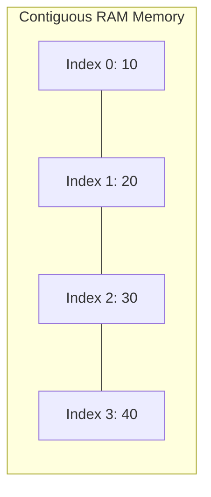

# Arrays in Java Overview

An **Array** is a linear data structure storing fixed-size collection of elements of the same data type in contiguous memory locations.

---

# How Does the Array Work?

Arrays are **zero-indexed** (first element is at index `0`, last element at `length - 1`).



---

# Creating an Array in Java

### Modern Java 25 Code Example:
```java
void main() {
    // 1. Array declaration with type inference (var)
    var numbers = new int[]{10, 20, 30, 40, 50};

    // 2. Accessing and updating elements
    println("First element: " + numbers[0]); // 10
    numbers[0] = 99;
    println("Updated first element: " + numbers[0]); // 99

    // 3. Finding array length
    println("Total elements: " + numbers.length);
}
```

---

# `for-each` Loop in Java

The enhanced `for-each` loop traverses array elements sequentially without managing index counters.

### Modern Java 25 Code Example:
```java
void main() {
    var names = new String[]{"Alice", "Bob", "Charlie"};

    // Modern for-each loop with var
    for (var name : names) {
        println("Hello, " + name);
    }
}
```

---

# Multidimensional Arrays in Java

Multidimensional arrays are arrays of arrays (2D matrices, 3D grids).

### Modern Java 25 Code Example (2D Matrix Traversal):
```java
void main() {
    // 2D Array initialization
    var matrix = new int[][]{
        {1, 2, 3},
        {4, 5, 6}
    };

    // Traverse 2D Array using modern nested for-each
    for (var row : matrix) {
        for (var val : row) {
            print(val + " ");
        }
        println();
    }
}
```
