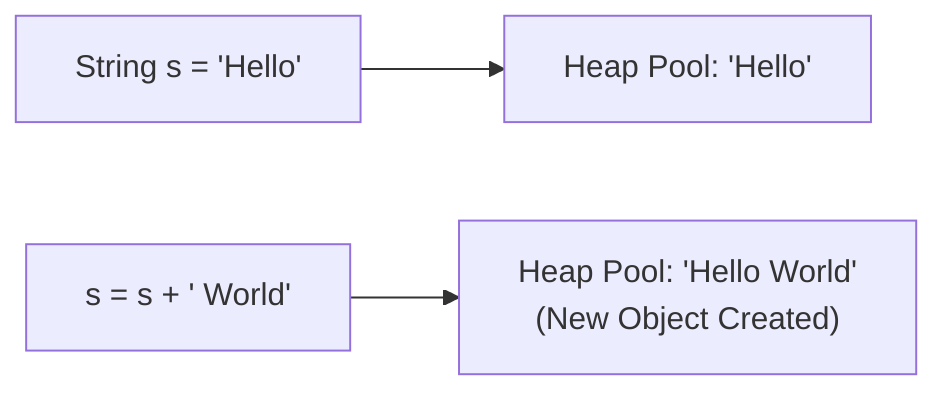

# Java String Overview

A **String** is an object representing a sequence of characters. In Java, strings are objects of the `java.lang.String` class.

---

# How to Create a Java String

1. **String Literal:** Stored in the **String Constant Pool (SCP)** inside heap memory.
2. **`new` Keyword:** Creates a new object directly in Heap memory outside the pool.

### Modern Java 25 Code Example:
```java
void main() {
    // 1. String Literal (uses String Pool)
    var str1 = "Java";

    // 2. new Keyword
    var str2 = new String("Java");

    // 3. Modern Multiline Text Blocks (Java 15-25+)
    var jsonText = """
        {
            "course": "Java 25",
            "status": "Active"
        }
        """;
    println(jsonText);
}
```

---

# Immutable String in Java

Strings in Java are **immutable** (cannot be modified once created). Any modification creates a new String object in memory.



---

# Comparison of Two Strings in Java

| Operator / Method | Comparison Type | Explanation |
| :--- | :--- | :--- |
| `==` | Reference comparison | Checks if both variables point to the **same memory address** |
| `.equals()` | Content comparison | Checks if both strings contain the **same characters** |
| `.equalsIgnoreCase()` | Case-insensitive content | Ignores upper/lowercase differences |

### Modern Java 25 Code Example:
```java
void main() {
    var s1 = "Hello";
    var s2 = "Hello";
    var s3 = new String("Hello");

    println(s1 == s2);      // true (same String Pool reference)
    println(s1 == s3);      // false (different heap memory references)
    println(s1.equals(s3)); // true (same textual content)
}
```

---

# Java String Methods

| Method | Description | Example Output |
| :--- | :--- | :--- |
| `.length()` | Total character count | `"Java".length()` ➔ `4` |
| `.toUpperCase()` | Converts to uppercase | `"java".toUpperCase()` ➔ `"JAVA"` |
| `.toLowerCase()` | Converts to lowercase | `"JAVA".toLowerCase()` ➔ `"java"` |
| `.charAt(i)` | Character at index `i` | `"Java".charAt(1)` ➔ `'a'` |
| `.substring(start, end)`| Extract sub-string | `"Hello".substring(1, 4)` ➔ `"ell"` |
| `.contains("text")` | Checks substring presence | `"Java 25".contains("25")` ➔ `true` |
| `.replace(old, new)` | Replaces characters | `"cat".replace('c', 'b')` ➔ `"bat"` |
