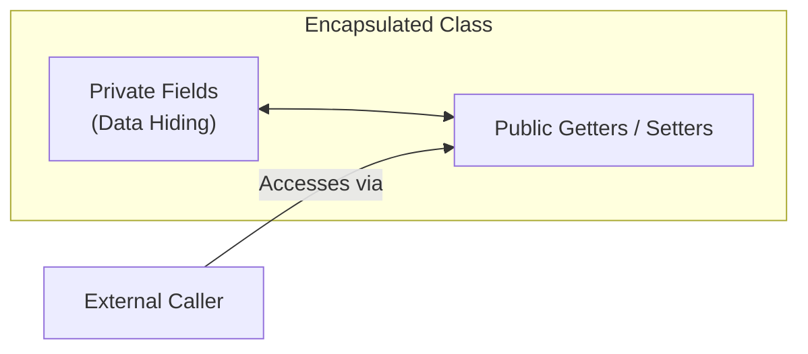

# Java Encapsulation & Data Hiding

**Encapsulation** wraps data (variables) and code (methods) together into a single unit, hiding private fields behind public **getter** and **setter** methods.



### Modern Java 25 Code Example (Getters/Setters & Records):
```java
class BankAccount {
    private double balance; // Private data hiding

    public double getBalance() { return balance; }

    public void deposit(double amount) {
        if (amount > 0) this.balance += amount;
    }
}

void main() {
    var acc = new BankAccount();
    acc.deposit(500.0);
    println("Balance: $" + acc.getBalance());
}
```

---

# Access Modifiers in Java

| Modifier | Visibility Scope |
| :--- | :--- |
| `private` | Visible only inside the **same class** |
| Default (package-private) | Visible inside the **same package** |
| `protected` | Visible in **same package** and **subclasses** |
| `public` | Visible **everywhere** across all packages |

---

# `static` Keyword & Static Methods

`static` members belong to the **class itself** rather than individual object instances.

### Modern Java 25 Code Example:
```java
class MathUtils {
    static final double PI = 3.14159;

    static int square(int x) {
        return x * x;
    }
}

void main() {
    // Access static members without creating an object instance
    println("Square: " + MathUtils.square(4)); // 16
}
```

---

# Java Abstraction (Abstract Classes & Interfaces)

**Abstraction** hides complex implementation details and shows only essential features to the user.

- **Abstract Class (`abstract`):** Can contain both abstract methods (without body) and concrete methods.
- **Interface (`interface`):** Defines a contract. Classes use `implements`. Modern Java interfaces support `default` methods with implementations.

### Modern Java 25 Code Example:
```java
interface Printable {
    void print(); // Abstract method

    // Modern Interface default method with body
    default void logStatus() {
        println("Status: Printing complete.");
    }
}

class Document implements Printable {
    public void print() {
        println("Printing PDF document...");
    }
}

void main() {
    var doc = new Document();
    doc.print();
    doc.logStatus();
}
```
