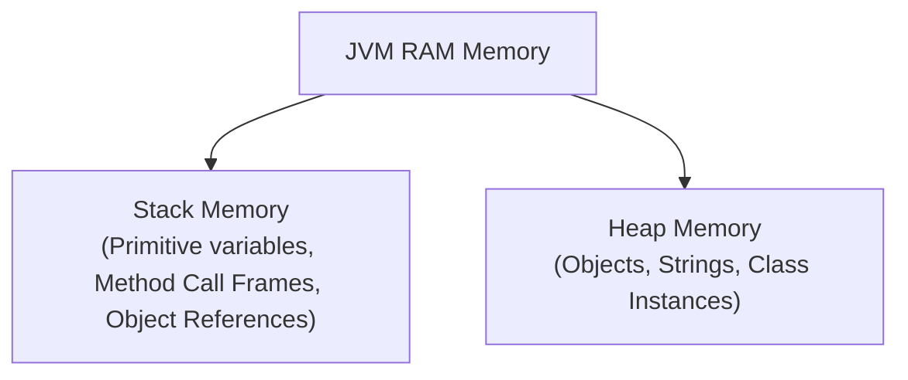

# Functional Interfaces & Lambda Expressions (`->`)

- **Functional Interface:** An interface containing exactly **one** abstract method (annotated with `@FunctionalInterface`).
- **Lambda Expression:** A concise representation of an anonymous function passed as data.

### Modern Java 25 Code Example:
```java
@FunctionalInterface
interface Calculator {
    int operate(int a, int b);
}

void main() {
    // Modern Lambda expression implementation
    Calculator add = (a, b) -> a + b;
    Calculator multiply = (a, b) -> a * b;

    println("Sum: " + add.operate(10, 20));       // 30
    println("Product: " + multiply.operate(5, 4)); // 20
}
```

---

# Java Memory Overview: Heap vs. Stack Memory

Java memory management divides RAM into two primary areas:



| Memory Region | What it Stores | Lifetime |
| :--- | :--- | :--- |
| **Stack Memory** | Local primitive variables & references to heap objects | Short-lived (destroyed when method returns) |
| **Heap Memory** | All objects created with `new`, arrays, String pool | Long-lived (managed by Garbage Collector) |

### Memory Allocation Code Example:
```java
void main() {
    int num = 10;                  // Stored in Stack Memory
    var name = new String("Java"); // Reference 'name' in Stack -> Object in Heap
}
```

---

# Java Polymorphism

**Polymorphism** allows an object to take many forms (Compile-time via Overloading, Run-time via Overriding).

### Modern Java 25 Pattern Matching for `switch` & `instanceof`:
```java
sealed interface Shape permits Circle, Square {}
record Circle(double radius) implements Shape {}
record Square(double side) implements Shape {}

double getArea(Shape shape) {
    // Modern Java Pattern Matching Switch (Java 21-25+)
    return switch (shape) {
        case Circle c -> Math.PI * c.radius() * c.radius();
        case Square s -> s.side() * s.side();
    };
}

void main() {
    Shape s = new Circle(5.0);
    println("Area: " + getArea(s));
}
```
