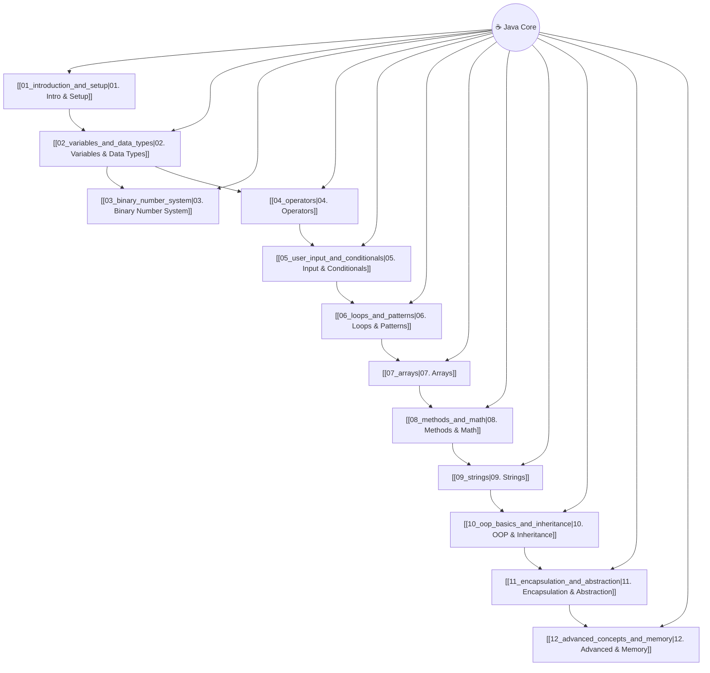

# ☕ Java (MOC - Map of Content)

Welcome to the **Java 2nd Brain Knowledge Base**. Below is the master index connecting all topics in this module.

---

## 📚 Curriculum Notes Index

### 1. Foundations & Setup
- [[01_introduction|01. Introduction and Setup]]
  - Programming Language Overview & Bridge Concept
  - Execution Flow (Source Code ➔ Bytecode ➔ Machine Code)
  - JVM, JRE, and JDK Architecture
  - IDE Shortcuts (`psvm`, `sout`, etc.)

### 2. Core Language Basics
- [[02_variables_and_data_types|02. Variables and Data Types]]
  - Reserved Keywords Table
  - Memory Allocation & Naming Rules
  - 8 Primitive Data Types
  - Implicit Widening Conversion
- [[03_binary_number_system|03. Binary Number System]]
  - Binary to Decimal & Arithmetic (Addition/Subtraction)
  - Two's Complement Representation
- [[04_operators|04. Operators]]
  - Arithmetic, Assignment, Relational, Logical, Bitwise, Ternary Operators
- [[05_user_input_and_conditionals|05. User Input and Conditionals]]
  - `Scanner` Class for User Input
  - Control Flow (`if`, `if-else`, `switch`)

### 3. Control Flow & Data Structures
- [[06_loops_and_patterns|06. Loops and Patterns]]
  - `for`, `while`, `do-while` Loops
  - Labeled `break` & `continue` Statements
- [[07_arrays|07. Arrays]]
  - 1D Arrays, `for-each` Loop, Multidimensional Arrays
- [[08_methods_and_math|08. Methods and Math]]
  - Method Components, Call Stack, Parameters, `Math` Class
- [[09_strings|09. Strings]]
  - String Immutability, Memory Pool, Operations & Methods

### 4. Object-Oriented Programming & Advanced Concepts
- [[10_oop_basics_and_inheritance|10. OOP Basics and Inheritance]]
  - Classes, Objects, Constructors, `this`, `super`, `final`
  - Inheritance & Method Overriding/Overloading
- [[11_encapsulation_and_abstraction|11. Encapsulation and Abstraction]]
  - Packages, Access Modifiers, Data Hiding, `static` Keyword
  - Abstract Classes & Interfaces
- [[12_advanced_concepts_and_memory|12. Advanced Concepts and Memory]]
  - Inner & Anonymous Classes, Lambdas
  - Stack vs. Heap Memory Allocation, Polymorphism
