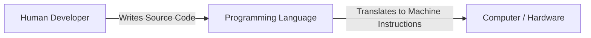
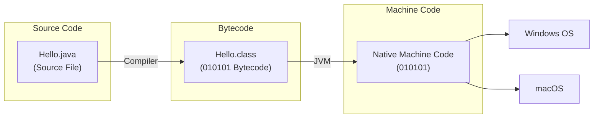
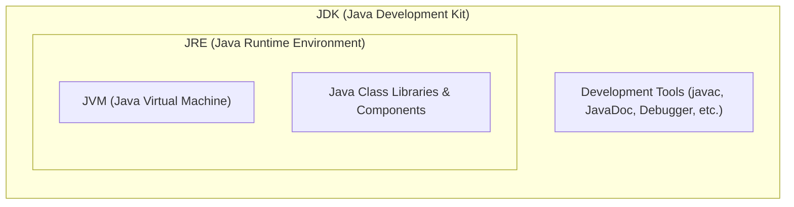
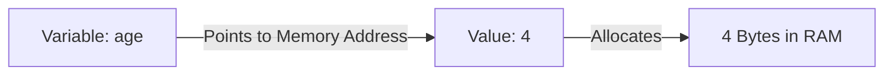

# What is a programming language?

## Overview
A **programming language** is the primary medium through which humans provide instructions to a computer. 

## Key Concepts
- **Machine-Level Instructions:** Computers inherently only understand machine-level instructions (binary/0s and 1s).
- **The Bridge:** Programming languages act as a bridge between human-readable logic/code and machine-executable instructions, allowing developers to write code that the machine can process and execute effectively.

## Visual Diagram



# Working of a Java Program

## Diagram



## Overview & Concept

## Execution Flow & Key Concepts
1. **Source Code:** Written by developers in human-readable `.java` files.
2. **Compilation Process:** The Java source code is compiled by the Java compiler (`javac`) into platform-independent **bytecode** (`Hello.class` files).
3. **Execution/Interpretation:** The Java Runtime Environment (JRE) / Java Virtual Machine (JVM) interprets or executes the bytecode to perform the desired tasks on the underlying system, allowing it to run across target OS environments like Windows and macOS.

---

# JVM, JRE and JDK

## Architecture Diagram



## Core Definitions

### JVM (Java Virtual Machine)
**JVM** is an abstract machine that enables your computer to run a Java program.

### JRE (Java Runtime Environment)
**JRE** is a software package that provides:
- **Java Class Libraries**
- **Java Virtual Machine (JVM)**
- Other components required to **run** Java applications.

### JDK (Java Development Kit)
**JDK** is a software development kit required to **develop** applications in Java.  
In addition to the **JRE**, the JDK contains a number of development tools:
- **Compiler** (`javac`)
- **JavaDoc**
- **Java Debugger** (`jdb`), etc.

---

# Useful Java IDE Typing Shortcuts (Live Templates)

In modern Java IDEs (like IntelliJ IDEA and Eclipse), you can use shorthand triggers followed by `Tab` or `Enter` to auto-generate boilerplate code quickly:

| Shortcut | Triggers | Generated Code |
| :--- | :--- | :--- |
| `psvm` + `Tab` / `main` + `Tab` | `public static void main(String[] args)` | Generates the main entry point method. |
| `sout` + `Tab` | `System.out.println();` | Prints output to the standard console with a newline. |
| `souf` + `Tab` | `System.out.printf("");` | Formatted output print statement. |
| `soutm` + `Tab` | `System.out.println("Class.method");` | Prints current class and method name (great for debugging). |
| `soutv` + `Tab` | `System.out.println("var = " + var);` | Prints a variable's name and its value. |
| `fori` + `Tab` | `for (int i = 0; i < ; i++) {}` | Standard indexed `for` loop. |

### Example Usage:
Instead of manually typing out:
```java
public static void main(String[] args) {
    System.out.println("Hello, World!");
}
```
Simply type:
1. `psvm` ➔ press <kbd>Tab</kbd>
2. `sout` ➔ press <kbd>Tab</kbd>

---

# Java Keywords

## Overview
Java keywords are reserved words that have predefined meanings in Java. They cannot be used as identifiers (such as variable names, class names, or method names). 

> **Note:** Over 90% of these keywords will be covered and used extensively throughout Java programming.

---

## Complete List of Java Keywords

| `abstract` | `continue` | `for`        | `new`       | `switch`       |
| :--------- | :--------- | :----------- | :---------- | :------------- |
| `assert`   | `default`  | `goto`       | `package`   | `synchronized` |
| `boolean`  | `do`       | `if`         | `private`   | `this`         |
| `break`    | `double`   | `implements` | `protected` | `throw`        |
| `byte`     | `else`     | `import`     | `public`    | `throws`       |
| `case`     | `enum`     | `instanceof` | `return`    | `transient`    |
| `catch`    | `extends`  | `int`        | `short`     | `try`          |
| `char`     | `final`    | `interface`  | `static`    | `void`         |
| `class`    | `finally`  | `long`       | `strictfp`  | `volatile`     |
| `const`    | `float`    | `native`     | `super`     | `while`        |

> *Note:* `const` and `goto` are reserved keywords in Java, but they are currently not used.

---

# Java Variables

## Concept & Memory Analogy
A **variable** is a named container/location in memory that holds a value during program execution.



### Code Example:
```java
int age = 4;    // Creates a variable named 'age' storing value 4
int x = 14;     // Variable 'x' storing value 14
```

---

## Rules for Naming Variables in Java

1. **Case-Sensitive:** Java is case-sensitive. Hence, `age` and `AGE` are treated as two completely different variables.
   ```java
   int age = 20;
   int AGE = 30; // Valid, but different from 'age'
   ```
2. **Starting Characters:** Variables must start with either a letter, an underscore (`_`), or a dollar sign (`$`).
   ```java
   int age = 25;    // Valid
   int _count = 5;  // Valid
   int $price = 100;// Valid
   // int 123age = 10; // INVALID (Cannot start with a digit)
   ```
3. **No Whitespace:** Variable names cannot contain whitespace/spaces.
   ```java
   // int my age = 20; // INVALID
   int myAge = 20;     // Valid (CamelCase recommended)
   ```
4. **No Reserved Keywords:** Variable names cannot be a Java keyword.
   ```java
   // int class = 10; // INVALID ('class' is a reserved keyword)
   int myClass = 10;   // Valid
   ```