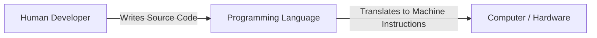
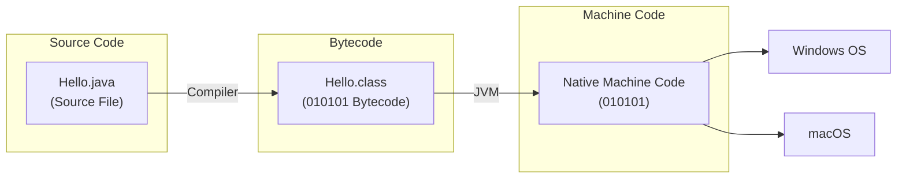
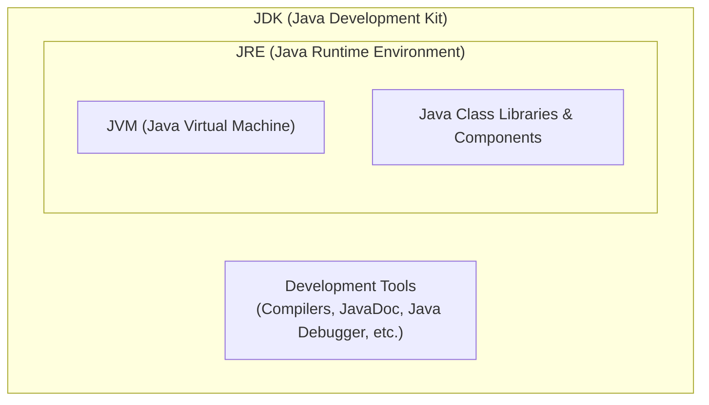

# What is a programming language?

## Overview
A **programming language** is the primary medium through which humans provide instructions to a computer. 

## Key Concepts
- **Machine-Level Instructions:** Computers inherently only understand machine-level instructions (binary/0s and 1s).
- **The Bridge:** Programming languages act as a bridge between human-readable logic/code and machine-executable instructions, allowing developers to write code that the machine can process and execute effectively.

## Visual Diagram

# Working of a Java Program

## Diagram

## Overview & Concept

**JVM (Java Virtual Machine):** JVM is an abstract machine that enables your computer to run a Java program.

## Execution Flow & Key Concepts
1. **Source Code:** Written by developers in human-readable `.java` files.
2. **Compilation Process:** The Java source code is compiled by the Java compiler (`javac`) into platform-independent **bytecode** (`Hello.class` files).
3. **Execution/Interpretation:** The Java Runtime Environment (JRE) / Java Virtual Machine (JVM) interprets or executes the bytecode to perform the desired tasks on the underlying system, allowing it to run across target OS environments like Windows and macOS.

---

# JVM, JRE and JDK

## Architecture Diagram

## Core Definitions

### JRE (Java Runtime Environment)
**JRE** is a software package that provides:
- **Java Class Libraries**
- **Java Virtual Machine (JVM)**
- Other components required to **run** Java applications.

### JDK (Java Development Kit)
**JDK** is a software development kit required to **develop** applications in Java.  
In addition to the **JRE**, the JDK contains a number of development tools:
- **Compiler** (`javac`)
- **JavaDoc**
- **Java Debugger** (`jdb`), etc.