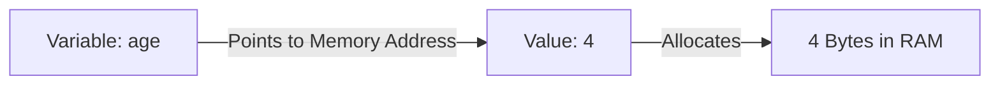
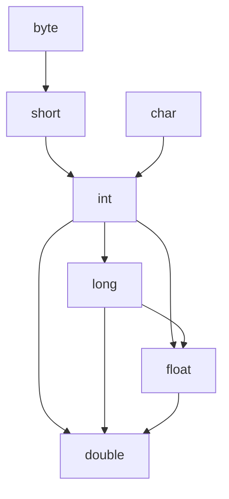

# Java Keywords

## Overview
Java keywords are reserved words that have predefined meanings in Java. They cannot be used as identifiers (such as variable names, class names, or method names). 

> **Note:** Over 90% of these keywords will be covered and used extensively throughout Java programming.

---

## Complete List of Java Keywords

| `abstract` | `continue` | `for`        | `new`       | `switch`       |
| :--------- | :--------- | :----------- | :---------- | :------------- |
| `assert`   | `default`  | `goto`       | `package`   | `synchronized` |
| `boolean`  | `do`       | `if`         | `private`   | `this`         |
| `break`    | `double`   | `implements` | `protected` | `throw`        |
| `byte`     | `else`     | `import`     | `public`    | `throws`       |
| `case`     | `enum`     | `instanceof` | `return`    | `transient`    |
| `catch`    | `extends`  | `int`        | `short`     | `try`          |
| `char`     | `final`    | `interface`  | `static`    | `void`         |
| `class`    | `finally`  | `long`       | `strictfp`  | `volatile`     |
| `const`    | `float`    | `native`     | `super`     | `while`        |

> *Note:* `const` and `goto` are reserved keywords in Java, but they are currently not used.

---

# Java Variables

## Concept & Memory Analogy
A **variable** is a named container/location in memory that holds a value during program execution.



### Code Example:
```java
int age = 4;    // Creates a variable named 'age' storing value 4
int x = 14;     // Variable 'x' storing value 14
```

---

## Rules for Naming Variables in Java

1. **Case-Sensitive:** Java is case-sensitive. Hence, `age` and `AGE` are treated as two completely different variables.
   ```java
   int age = 20;
   int AGE = 30; // Valid, but different from 'age'
   ```
2. **Starting Characters:** Variables must start with either a letter, an underscore (`_`), or a dollar sign (`$`).
   ```java
   int age = 25;    // Valid
   int _count = 5;  // Valid
   int $price = 100;// Valid
   // int 123age = 10; // INVALID (Cannot start with a digit)
   ```
3. **No Whitespace:** Variable names cannot contain whitespace/spaces.
   ```java
   // int my age = 20; // INVALID
   int myAge = 20;     // Valid (CamelCase recommended)
   ```
4. **No Reserved Keywords:** Variable names cannot be a Java keyword.
   ```java
   // int class = 10; // INVALID ('class' is a reserved keyword)
   int myClass = 10;   // Valid
   ```

---

# 8 Types of Primitive Data Types

Data types specify the size and type of values that can be stored in a variable. Java has **8 primitive data types**:

| Data Types | Size | Default Value | Explanation |
| :--- | :--- | :--- | :--- |
| `boolean` | 1 bit | `false` | Stores `true` or `false` values |
| `byte` | 1 byte / 8 bits | `0` | Stores whole numbers from -128 to 127 |
| `short` | 2 bytes / 16 bits | `0` | Stores whole numbers from -32,768 to 32,767 |
| `int` | 4 bytes / 32 bits | `0` | Stores whole numbers from -2,147,483,648 to 2,147,483,647 |
| `long` | 8 bytes / 64 bits | `0L` | Stores whole numbers from -9,223,372,036,854,775,808 to 9,223,372,036,854,775,807 |
| `float` | 4 bytes / 32 bits | `0.0f` | Stores fractional numbers. Sufficient for storing 6 to 7 decimal digits |
| `double` | 8 bytes / 64 bits | `0.0d` | Stores fractional numbers. Sufficient for storing 15 decimal digits |
| `char` | 2 bytes / 16 bits | `'\u0000'` | Stores a single character/letter or ASCII values |

---

# Data Types Implicit Conversion (Direct / Widening)

## Overview & Concept
**Implicit Conversion** (also known as **Widening Conversion** or **Automatic Type Conversion**) happens automatically when a smaller data type is assigned to a larger data type. 

### Bucket Analogy
Think of data types as buckets of different sizes (`short` ➔ `int` ➔ `long`):
- Pouring a smaller bucket (`short`) into a larger bucket (`int` / `long`) happens **automatically/implicitly** without overflowing.

---

## Conversion Flow Diagram



---

## Conversion Hierarchy Order:
`byte` ➔ `short` ➔ `int` ➔ `long` ➔ `float` ➔ `double`  
`char` ➔ `int`

### Code Example:
```java
int numInt = 100;
long numLong = numInt;    // Implicit widening: int (4 bytes) automatically converts to long (8 bytes)
double numDouble = numLong;// Implicit widening: long (8 bytes) automatically converts to double
```
