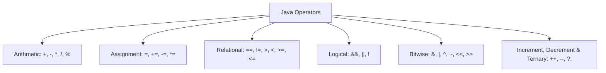

# Types of Operators in Java


An **operator** is a special symbol used to perform operations on [[02_variables_and_data_types|variables and values]]. The values that an operator operates on are called **operands**.



---

# Arithmetic Operators

Arithmetic operators perform basic mathematical calculations.

| Operator | Name | Description | Example ($a = 10, b = 3$) | Result |
| :--- | :--- | :--- | :--- | :--- |
| `+` | Addition | Adds two values | `a + b` | `13` |
| `-` | Subtraction | Subtracts right operand from left | `a - b` | `7` |
| `*` | Multiplication | Multiplies two values | `a * b` | `30` |
| `/` | Division | Divides left operand by right (Integer division truncates decimals) | `a / b` | `3` |
| `%` | Modulus | Returns the remainder of division | `a % b` | `1` |

### Code Example:
```java
int a = 10;
int b = 3;
System.out.println("Sum: " + (a + b));      // 13
System.out.println("Remainder: " + (a % b));// 1
```

---

# Assignment Operators

Assignment operators assign values to variables.

| Operator | Example | Equivalent To | Description |
| :--- | :--- | :--- | :--- |
| `=` | `x = 5` | `x = 5` | Simple assignment |
| `+=` | `x += 3` | `x = x + 3` | Add AND assignment |
| `-=` | `x -= 2` | `x = x - 2` | Subtract AND assignment |
| `*=` | `x *= 4` | `x = x * 4` | Multiply AND assignment |
| `/=` | `x /= 2` | `x = x / 2` | Divide AND assignment |
| `%=` | `x %= 3` | `x = x % 3` | Modulus AND assignment |

---

# Relational Operators

Relational (comparison) operators compare two values and return a `boolean` result (`true` or `false`).

| Operator | Meaning | Example ($a = 10, b = 20$) | Result |
| :--- | :--- | :--- | :--- |
| `==` | Equal to | `a == b` | `false` |
| `!=` | Not equal to | `a != b` | `true` |
| `>` | Greater than | `a > b` | `false` |
| `<` | Less than | `a < b` | `true` |
| `>=` | Greater than or equal to | `a >= 10` | `true` |
| `<=` | Less than or equal to | `b <= 20` | `true` |

---

# Logical Operators

Logical operators combine boolean expressions.

| Operator | Name | Description | Example ($A = \text{true}, B = \text{false}$) | Result |
| :--- | :--- | :--- | :--- | :--- |
| `&&` | Logical AND | Returns `true` only if **both** statements are true | `A && B` | `false` |
| `\|\|` | Logical OR | Returns `true` if **at least one** statement is true | `A \|\| B` | `true` |
| `!` | Logical NOT | Reverses the boolean result (`true` ➔ `false`) | `!A` | `false` |

> **Short-Circuit Evaluation:**
> - In `&&`, if the left expression is `false`, the right expression is **not evaluated**.
> - In `||`, if the left expression is `true`, the right expression is **not evaluated**.

---

# Bitwise Operators

Bitwise operators manipulate individual bits of numbers using [[03_binary_number_system|binary representation]].

| Operator | Name | Description | Example ($5 = 0101_2, 3 = 0011_2$) | Result |
| :--- | :--- | :--- | :--- | :--- |
| `&` | Bitwise AND | Sets bit to 1 if both bits are 1 | `5 & 3` ($0001_2$) | `1` |
| `\|` | Bitwise OR | Sets bit to 1 if at least one bit is 1 | `5 \| 3` ($0111_2$) | `7` |
| `^` | Bitwise XOR | Sets bit to 1 if bits are different | `5 ^ 3` ($0110_2$) | `6` |
| `~` | Bitwise NOT | Inverts all bits (1's complement) | `~5` | `-6` |
| `<<` | Left Shift | Shifts bits left by $n$ places ($x \times 2^n$) | `5 << 1` ($1010_2$) | `10` |
| `>>` | Right Shift | Shifts bits right by $n$ places ($x / 2^n$) | `5 >> 1` ($0010_2$) | `2` |

---

# Increment, Decrement & Ternary Operators

## 1. Increment (`++`) and Decrement (`--`) Operators
Used to increase or decrease a variable's value by 1.

| Type | Syntax | Operation | Difference |
| :--- | :--- | :--- | :--- |
| **Pre-Increment** | `++a` | Increments first, then uses value | Value updated before expression evaluation |
| **Post-Increment** | `a++` | Uses current value first, then increments | Value updated after expression evaluation |
| **Pre-Decrement** | `--a` | Decrements first, then uses value | Value updated before expression evaluation |
| **Post-Decrement** | `a--` | Uses current value first, then decrements | Value updated after expression evaluation |

### Code Example:
```java
var x = 5;
var y = ++x; // x becomes 6, y becomes 6

var a = 5;
var b = a++; // b gets 5, then a becomes 6
```

---

## 2. Ternary Operator (`?:`)
A shorthand inline replacement for simple `if-else` statements.

### Syntax:
```java
var variable = (condition) ? expressionIfTrue : expressionIfFalse;
```

### Code Example:
```java
var age = 18;
var status = (age >= 18) ? "Adult" : "Minor"; // Infers String, returns "Adult"
```

