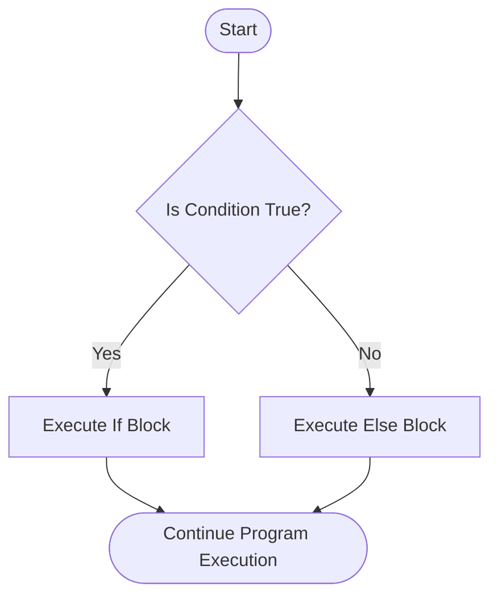
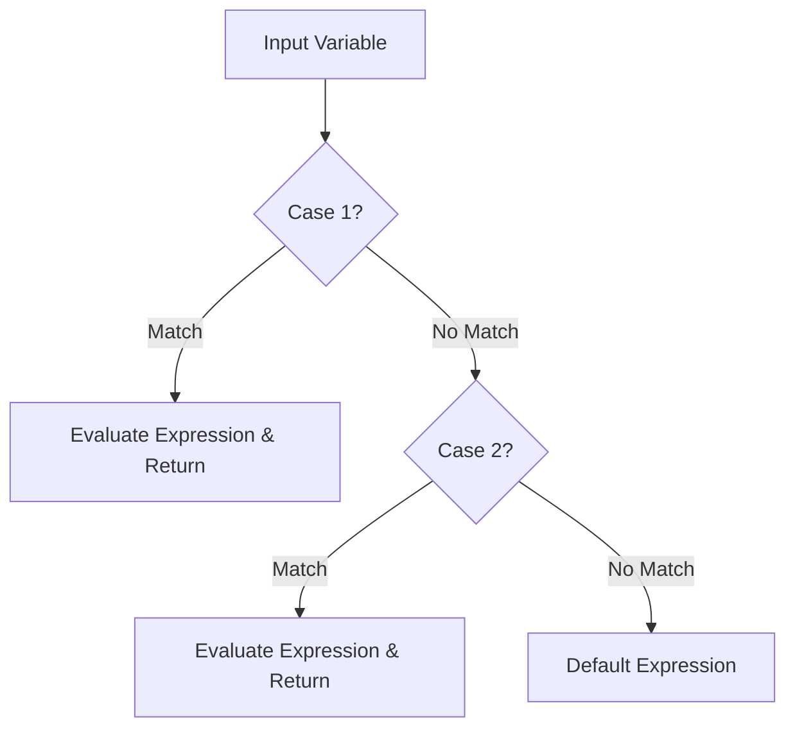

# Taking User Input Using Scanner in Java

In modern Java (Java 21 to Java 25+), we can write clean, top-level code using **Implicitly Declared Classes and Instance Main Methods** (JEP 463/495 / Flexible Main Methods).

## Common `Scanner` Methods

| Method | Reads |
| :--- | :--- |
| `nextInt()` | An integer value |
| `nextDouble()` | A double floating-point value |
| `nextFloat()` | A float value |
| `next()` | A single word (stops at space) |
| `nextLine()` | An entire line of text (string) |
| `nextBoolean()` | A boolean value (`true`/`false`) |

### Modern Java Code Example (Java 21-25+):
```java
// Java 21-25+ Modern Main Method (Implicit class & try-with-resources)
import java.util.Scanner;

void main() {
    try (var sc = new Scanner(System.in)) {
        System.out.print("Enter your age: ");
        int age = sc.nextInt();

        System.out.println("You are " + age + " years old.");
    } // Scanner is automatically closed here via try-with-resources
}
```

---

# Java Conditional Statements

Conditional statements control the execution flow of a program based on boolean expressions (`true` or `false`).



---

# Java `if - else` Statements

Executes one block of code if the condition is `true`, and an alternative block if it is `false`.

### Modern Code Example (using `var` local variable type inference):
```java
void main() {
    var number = 10;

    if (number % 2 == 0) {
        System.out.println("Even number");
    } else {
        System.out.println("Odd number");
    }
}
```

---

# Java `if - else if - else` Statements

Used to test multiple conditions sequentially.

### Modern Code Example:
```java
void main() {
    var score = 85;

    if (score >= 90) {
        System.out.println("Grade: A");
    } else if (score >= 80) {
        System.out.println("Grade: B");
    } else if (score >= 70) {
        System.out.println("Grade: C");
    } else {
        System.out.println("Grade: F");
    }
}
```

---

# Nested `if - else` Statements

An `if` or `if-else` statement placed inside another `if` or `else` block.

### Modern Code Example:
```java
void main() {
    var age = 20;
    var hasID = true;

    if (age >= 18) {
        if (hasID) {
            System.out.println("Entry Allowed");
        } else {
            System.out.println("ID required");
        }
    } else {
        System.out.println("Underage - Entry Denied");
    }
}
```

---

# Java Ternary Operators

A compact, single-line shorthand for an `if-else` block.

### Syntax:
$$\text{variable} = (\text{condition}) ? \text{expressionIfTrue} : \text{expressionIfFalse};$$

### Modern Code Example:
```java
void main() {
    var number = 7;
    var result = (number % 2 == 0) ? "Even" : "Odd";
    System.out.println(result); // Outputs: Odd
}
```

---

# Modern Java `switch` Expressions & Arrow Rules (Java 14 - 25+)

In modern Java, **Switch Expressions (`->`)** replace traditional colon syntax and `break` statements. Switch expressions:
1. **Eliminate Fall-Through:** No `break` keywords required; only the matching case executes.
2. **Can Return Values:** Switch can be assigned directly to variables.
3. **Pattern Matching & Multiple Values:** Allows comma-separated case values and type pattern matching.

## Switch Flow Diagram



### Modern Switch Expression Example (Returning Values):
```java
void main() {
    var day = 3;

    // Modern Switch Expression (Java 14+) assigning directly to variable
    var dayName = switch (day) {
        case 1 -> "Monday";
        case 2 -> "Tuesday";
        case 3 -> "Wednesday";
        case 4, 5 -> "Thursday or Friday";
        default -> "Weekend / Invalid day";
    };

    System.out.println(dayName); // Outputs: Wednesday
}
```

### Modern Switch Statement with Arrow Rules (No `break` needed):
```java
void main() {
    var day = 2;

    // Modern arrow rules without returning a value
    switch (day) {
        case 1 -> System.out.println("Monday");
        case 2 -> System.out.println("Tuesday");
        case 3 -> System.out.println("Wednesday");
        default -> System.out.println("Other day");
    }
}
```

> **Modern Java Advantage:** Arrow syntax (`case X ->`) guarantees no accidental **fall-through**, completely eliminating the need for `break` statements!
