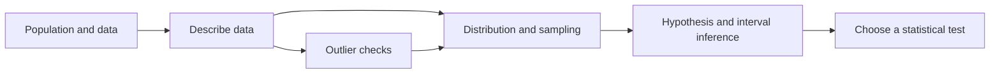

# Statistics - Exam Study Hub

Source playlist: [Statistics for Data Analysis and Data Science](https://youtube.com/playlist?list=PLTDARY42LDV6YHSRo669_uDDGmUEmQnDJ)

Use this hub as your learning path. Each note contains five connected tutorials, key formulas, examples, and quick exam checks.

## Learning path

1. [[01 Foundations - Statistics to Dispersion|Foundations (Tutorials 1-5)]]
2. [[02 Descriptive Analysis - Percentiles to CLT|Descriptive analysis and CLT (Tutorials 6-10)]]
3. [[03 Distributions and Hypotheses - Lognormal to Python|Distributions and hypothesis setup (Tutorials 11-15)]]
4. [[04 Inference - Probability Functions to Confidence Intervals|Inference (Tutorials 16-20)]]
5. [[05 Statistical Tests - Chi-square to Variance Ratio|Statistical tests (Tutorials 21-25)]]

## Concept map

## Exam workflow

1. Identify the variable type and whether data are paired or independent.
2. State the population, sample, parameter, and statistic.
3. Describe the data with centre, spread, shape, and outliers.
4. Write the null and alternative hypotheses before selecting a test.
5. Check assumptions, calculate the statistic/p-value, then interpret in context.

## Formula jump list

- Centre and spread: [[01 Foundations - Statistics to Dispersion#Tutorial 4 - mean median and mode|mean, median, mode]]; [[01 Foundations - Statistics to Dispersion#Tutorial 5 - variance and standard deviation|variance and SD]]
- Quartiles and outliers: [[02 Descriptive Analysis - Percentiles to CLT#Tutorials 6-8 - percentiles quartiles box plots and outliers|quartiles / IQR]]
- Sampling behaviour: [[02 Descriptive Analysis - Percentiles to CLT#Tutorial 10 - central limit theorem|CLT]]
- Test decisions: [[03 Distributions and Hypotheses - Lognormal to Python#Tutorial 14 - hypothesis testing|hypothesis testing]], [[04 Inference - Probability Functions to Confidence Intervals#Tutorials 17-20 - z t errors and confidence intervals|z, t, errors, CI]]
- Categorical and multi-group tests: [[05 Statistical Tests - Chi-square to Variance Ratio|chi-square, ANOVA, F, variance ratio]]

> [!TIP]
> For exam revision, cover the answers in each note's “Quick check” section and explain the choice of method aloud.
